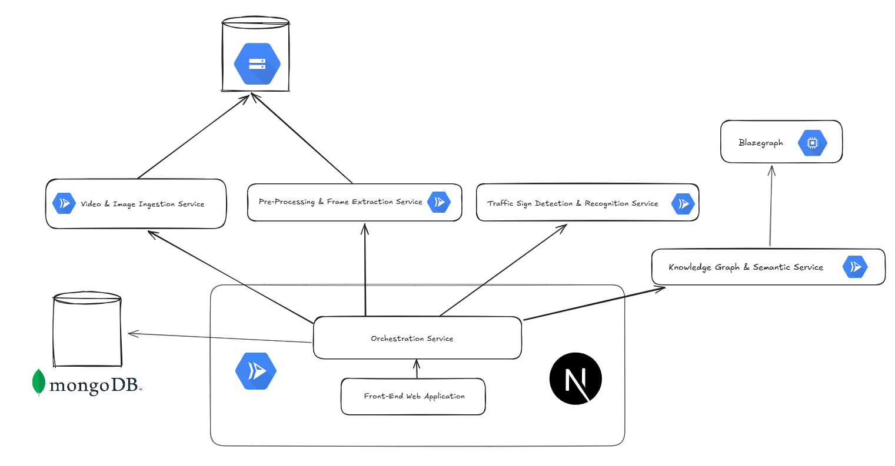
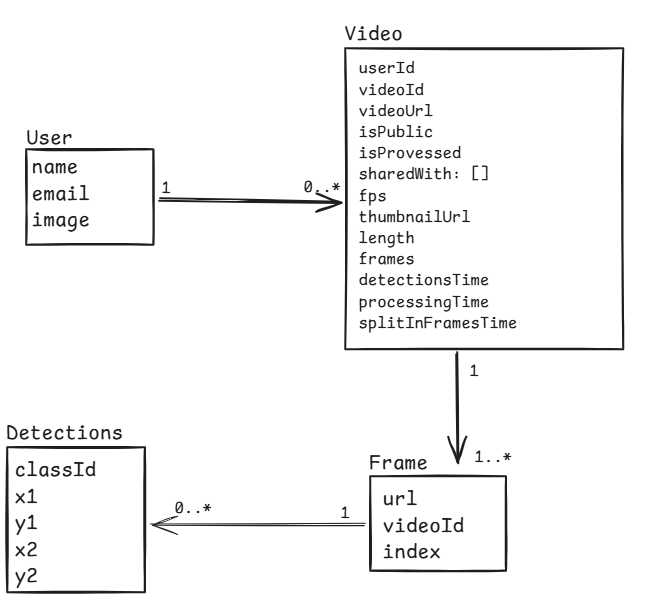
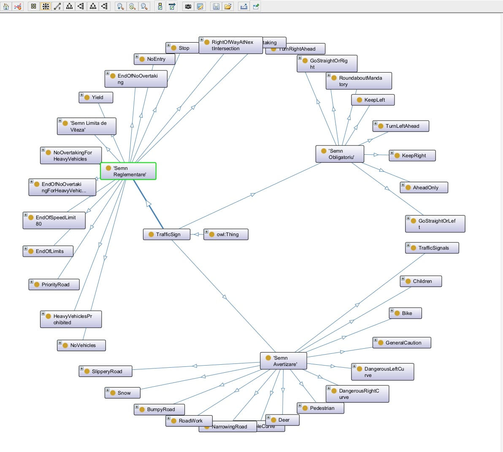

# Traffic Sign Recognition System

## 📌 Project Overview
The **Traffic Sign Recognition (TSR) System** is a cloud-based solution for detecting, classifying, and analyzing traffic signs from uploaded videos. The system extracts frames from videos, applies machine learning models for sign recognition, and integrates with a knowledge graph for enhanced semantic understanding.

## 🚀 Features
- **Video Upload & Processing:** Users can upload videos, which are stored in Google Cloud Storage (GCS).
- **Frame Extraction:** Videos are split into frames for analysis.
- **Traffic Sign Detection:** Machine learning models classify traffic signs in frames.
- **Semantic Enrichment:** Recognized signs are linked to a knowledge graph using Blazegraph.
- **Next.js Web Interface:** A modern front-end allows users to interact with the system, view results, and share processed videos.
- **Authentication:** GitHub-based authentication for secure access.

## 🏗️ Architecture
The system follows a **microservices-based architecture** deployed on **Google Cloud Run**, with services communicating via REST APIs. The main components include:
### 🔹 **System Architecture**



### 🔹 **Database Schema**


### 🔹 **Ontology Graph**


### 🔹 **Cloud Services**
1. **Google Cloud Storage (GCS):** Stores uploaded videos and extracted frames.
2. **Google Cloud Run:** Runs various microservices for processing and analysis.
3. **Google Artifact Registry:** Stores Docker images for microservices.
4. **MongoDB Atlas:** Stores metadata about videos, frames, and detections.
5. **Blazegraph:** Provides semantic reasoning for recognized traffic signs.

### 🔹 **Microservices**
| Service | Description | Resources |
|---------|-------------|------------|
| **Video Ingestion Service** | Handles video uploads and stores them in GCS | 8080, 500MB request size |
| **Frame Extraction Service** | Extracts frames from videos for further analysis | 4GB RAM, 2 CPU |
| **Sign Detection Service** | Detects and classifies traffic signs | 4GB RAM, 2 CPU, Autoscaling (1-3 instances) |
| **Ontology & Knowledge Graph Service** | Integrates detected signs with a knowledge graph | 1GB RAM, 1 CPU |
| **TSR Frontend App** | Next.js-based UI for video processing and sign visualization | 4GB RAM, 2 CPU |

## 🛠️ Technologies Used
- **Frontend:** Next.js, React
- **Backend:** Flask (Python)
- **Database:** MongoDB Atlas, Blazegraph
- **Storage:** Google Cloud Storage (GCS)
- **Deployment:** Google Cloud Run, Google Artifact Registry
- **Authentication:** NextAuth.js (GitHub OAuth)
- **Machine Learning:** ONNX-based traffic sign classification

## 🔧 Setup & Deployment
### Prerequisites
- Google Cloud Platform (GCP) account
- Terraform installed for infrastructure provisioning
- Docker installed for building container images

### 1️⃣ Clone the Repository
```sh
git clone https://github.com/PopoviciMarian/WADE-Traffic-Sign-Smart-Detector.git
```

### 2️⃣ Set Up Google Cloud Environment
1. **Authenticate GCP CLI:**
```sh
gcloud auth login
```
2. **Set project ID:**
```sh
gcloud config set project YOUR_PROJECT_ID
```

### 3️⃣ Deploy Infrastructure with Terraform
```sh
terraform init
terraform apply -auto-approve
```
This sets up **GCS buckets, Cloud Run services, and IAM policies**.

### 4️⃣ Deploy Microservices with GitHub Actions
Each microservice has an automated **GitHub Actions workflow** for CI/CD deployment.

Example workflow for **Frame Extraction Service**:

```yaml
name: Deploy Frame Extraction Service to GCP

env:
  FULL_IMAGE_NAME: us-central1-docker.pkg.dev/${{ secrets.GCP_PROJECT_ID }}/docker-repo-wade-1/frame-extraction-service

on:
  push:
    branches:
      - frame-extraction-service
      - main
    paths:
      - 'frame-extraction-service/**'
      - '.github/workflows/deploy-frame-extraction-service.yml'

jobs:
  build-and-deploy:
    runs-on: ubuntu-latest

    steps:
      - name: Checkout code
        uses: actions/checkout@v3

      - name: Authenticate to Google Cloud
        uses: google-github-actions/auth@v2
        with:
          credentials_json: ${{ secrets.GCP_SA_KEY }}

      - name: Set up Google Cloud SDK
        uses: google-github-actions/setup-gcloud@v2

      - name: Set up Docker Buildx
        uses: docker/setup-buildx-action@v2

      - name: Configure Docker to use GCP Artifact Registry
        run: gcloud auth configure-docker us-central1-docker.pkg.dev

      - name: Build and Push Docker Image
        run: |
          cd frame-extraction-service
          docker buildx build --cache-from=type=registry,ref=$FULL_IMAGE_NAME \
                              --cache-to=type=inline \
                              -t $FULL_IMAGE_NAME . \
                              --push

      - name: Deploy to Cloud Run
        run: |
          gcloud run deploy frame-extraction-service \
            --image $FULL_IMAGE_NAME \
            --platform managed \
            --region us-central1 \
            --allow-unauthenticated
```

### 5️⃣ Frontend Setup
1. Navigate to the frontend folder:
```sh
cd frontend
```
2. Install dependencies:
```sh
npm install
```
3. Start the local development server:
```sh
npm run dev
```

## 🔍 Usage
1. **Upload a video** via the web interface.
2. The system processes the video by:
   - Storing it in GCS
   - Extracting frames
   - Running traffic sign detection models
   - Storing metadata in MongoDB
3. **View detected traffic signs** in the frontend.
4. **Query the knowledge graph** for enriched insights.

## 🔒 Security & IAM Policies
- All Cloud Run services are **publicly accessible** (`roles/run.invoker` assigned to `allUsers`).
- MongoDB and Blazegraph require **authenticated access** via environment variables.

## 📜 API Endpoints
### **Video Ingestion Service**
- `POST /upload`: Uploads a video
- `GET /videos`: Retrieves uploaded videos

### **Frame Extraction Service**
- `POST /extract-frames`: Extracts frames from video

### **Sign Detection Service**
- `POST /detect-signs`: Detects traffic signs in a frame

### **Ontology Service**
- `GET /ontology`: Retrieves traffic sign metadata from the knowledge graph

